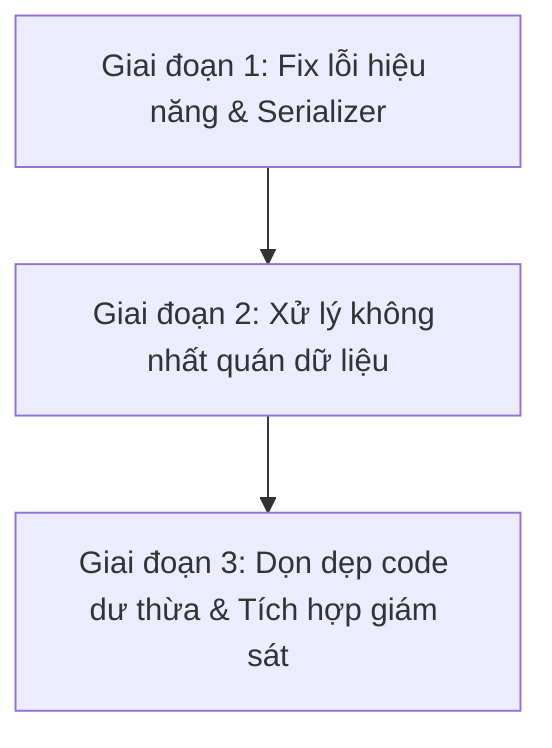

# Báo Cáo Đánh Giá Và Kế Hoạch Cải Tiến Hệ Thống Cache

Báo cáo này đánh giá chi tiết thiết kế, hiệu năng, tính an toàn dữ liệu của gói `com.chatbot.core.cache` cùng cấu hình Redis Cache trong hệ thống Chatbot SaaS v2.1, từ đó đề xuất kế hoạch nâng cấp và sửa lỗi.

---

## 1. Đánh Giá Hiện Trạng Hệ Thống Cache

Hệ thống cache hiện tại được xây dựng dựa trên sự kết hợp giữa **Spring Cache (Declarative)** và **RedisTemplate (Imperative)** qua Redis. 

### 1.1. Điểm mạnh (Strengths)
* **Cấu hình TTL chi tiết:** Hệ thống đã định nghĩa thời gian sống (TTL) khác nhau cho từng loại cache trong `CacheConfig.java` (ví dụ: `users` 30 phút, `tenants` 15 phút, `chatbots` 10 phút, `provinces`/`districts`/`districts` 1 ngày), giúp tối ưu hóa dung lượng RAM của Redis.
* **Cơ chế Cache Warming:** Lớp `CacheWarmer` tự động nạp trước các dữ liệu tĩnh hoặc dữ liệu truy cập thường xuyên (danh sách gói cước, tenant đang active, bot active) ngay khi ứng dụng khởi động thành công, giúp tránh hiện tượng nghẽn cổ chai cơ sở dữ liệu (Database Cold Start).

---

### 1.2. Các Lỗi và Rủi ro nghiêm trọng (Critical Issues & Risks)

#### Vấn đề 1: Rủi ro nghẽn hiệu năng do sử dụng lệnh `KEYS *` (Performance Block)
* **Chi tiết:** Trong `CacheService.getStatistics()` và `CacheStatisticsMonitor.getStatistics()`, hệ thống sử dụng lệnh `redisTemplate.keys("*")` để đếm tổng số lượng key trong database.
* **Nguy cơ:** Lệnh `KEYS` trong Redis là thao tác đồng bộ có độ phức tạp $O(N)$ (quét toàn bộ cơ sở dữ liệu). Vì Redis chạy đơn luồng (single-threaded), khi hệ thống chạy thực tế với số lượng key lớn (hàng trăm ngàn đến hàng triệu key), lệnh này sẽ **khóa toàn bộ Redis** trong vài giây đến vài chục giây. Tất cả các request đồng thời liên quan đến kiểm tra rate limit, session user, gửi nhận tin nhắn sẽ bị nghẽn (timeout) và gây sập hệ thống dây chuyền.
* **Độ ưu tiên:** **Khẩn cấp (Critical)**

#### Vấn đề 2: Không nhất quán dữ liệu (Cache Inconsistency) ở các thực thể quan trọng
Do thiếu cơ chế thu hồi cache (Eviction) khi dữ liệu dưới DB thay đổi, hệ thống sẽ đọc ra dữ liệu cũ từ bộ nhớ đệm:
1. **Dữ liệu Tenant:** Khi thực hiện nâng cấp/mua gói cước thành công tại `TenantPackageService.upgradeTenantPackage()`, thông tin gói cước mới (`currentPackageId`) và ngày hết hạn (`expiresAt`) được lưu xuống DB. Tuy nhiên, thông tin tenant cũ trong cache `"tenants"` (được tạo bởi `TenantService.getTenant()`) không bị xóa. Hệ thống sẽ tiếp tục sử dụng giới hạn của gói cũ trong tối đa 15 phút (cho đến khi cache tự hết hạn).
2. **Dữ liệu User:** Khi admin thay đổi trạng thái user (`updateUserStatus` đặt `isActive = false`) hoặc cập nhật số dư tài khoản (`UserBalanceService`), thông tin trong cache `"users"` không được làm sạch. `UserEntityListener` hiện tại chỉ mới evict cache `"userSessions"` theo email mà bỏ quên `"users"` theo ID.
* **Độ ưu tiên:** **Cao (High)**

#### Vấn đề 3: Sai lệch Serializer tại `CacheService`
* **Chi tiết:** Trong `UnifiedRedisConfig.java`, bean `@Primary` `redisTemplate` sử dụng `StringRedisSerializer` cho cả key và value (phù hợp cho các chuỗi phẳng như rate limit, token blacklist). Một bean khác là `cacheRedisTemplate` được cấu hình `GenericJackson2JsonRedisSerializer` để chuyển đổi đối tượng Java thành JSON.
* **Vấn đề:** Lớp `CacheService` hiện tại đang tiêm trực tiếp `redisTemplate` (bản `@Primary` dùng StringSerializer). Khi các dịch vụ khác gọi `cacheService.set(key, object)` hoặc các hàm ghi Hash/Set với object phức tạp, Redis sẽ ném ra lỗi `ClassCastException` hoặc ghi dữ liệu lỗi do không thể serialize đối tượng Java sang String.
* **Độ ưu tiên:** **Cao (High)**

#### Vấn đề 4: Code trùng lặp và Dư thừa (Dead Code / Redundancy)
* **Chi tiết:** 
  - Bean `CacheStatisticsMonitor` được khai báo cấu hình nhưng không được tiêm (`@Autowired`) hoặc sử dụng ở bất kỳ đâu trong hệ thống.
  - Lớp `CacheService` chứa các hàm trống (placeholders) cho cache warming (`warmUpPackages()`, `warmUpTenants()`, `warmUpChatbots()`) trùng lặp với logic thật đã được viết trong `CacheWarmer.java`.
  - Hàm `getStatistics()` trong `CacheService` trả về đối tượng thống kê trống (`usedMemory = 0`, `maxMemory = 0`) và hit-rate giả lập (`0.85`), trong khi `CacheStatisticsMonitor` có logic tính toán thật tốt hơn nhưng không được dùng.
* **Độ ưu tiên:** **Trung bình (Medium)**

---

## 2. Kế Hoạch Cải Tiến Chi Tiết

Kế hoạch cải tiến sẽ được chia làm 3 giai đoạn chính để đảm bảo tính an toàn và dễ dàng kiểm thử.



### 2.1. Giai đoạn 1: Khắc phục rủi ro hiệu năng và Lỗi Serializer (Thực hiện ngay)
* **Nhiệm vụ 1.1:** Thay thế lệnh `keys("*")` bằng lệnh lấy kích thước database $O(1)$ an toàn tại `CacheService` và `CacheStatisticsMonitor`.
  * *Mã nguồn thay thế:*
    ```java
    // Thay vì: Set<String> allKeys = redisTemplate.keys("*");
    Long size = redisTemplate.getConnectionFactory().getConnection().dbSize();
    int keyCount = size != null ? size.intValue() : 0;
    ```
* **Nhiệm vụ 1.2:** Sửa cơ chế Injection trong `CacheService.java` để sử dụng đúng `cacheRedisTemplate` có hỗ trợ JSON Serializer.
  * *Mã nguồn thay thế:*
    ```java
    public CacheService(@Qualifier("cacheRedisTemplate") RedisTemplate<String, Object> redisTemplate) {
        this.redisTemplate = redisTemplate;
    }
    ```

### 2.2. Giai đoạn 2: Xử lý không nhất quán dữ liệu (Cache Eviction)
Để đảm bảo dữ liệu luôn chính xác khi có cập nhật, ta sẽ áp dụng cơ chế JPA Entity Listener kết hợp Spring Cache Evict.

* **Nhiệm vụ 2.1: Đồng bộ hóa Cache của Tenant**
  * Tạo class `TenantEntityListener` lắng nghe các sự kiện thay đổi trên thực thể `Tenant` (`@PostUpdate`, `@PostPersist`, `@PostRemove`) để tự động xóa các cache:
    - Cache `"tenants"` (key: `tenantId`)
    - Cache `"tenant-key-to-id"` (key: `tenantKey`)
  * Đăng ký `@EntityListeners(TenantEntityListener.class)` trên thực thể `Tenant.java`.
  * *Ý nghĩa:* Khi `TenantPackageService` nâng cấp gói hoặc có bất kỳ thay đổi nào từ DB, cache sẽ được làm sạch ngay lập tức, khách hàng không bị trễ gói cước.

* **Nhiệm vụ 2.2: Đồng bộ hóa Cache của User**
  * Cập nhật `UserEntityListener.java` để bổ sung việc dọn dẹp cache `"users"` theo `userId`:
    ```java
    Cache usersCache = cacheManager.getCache("users");
    if (usersCache != null && user.getId() != null) {
        usersCache.evict(user.getId());
    }
    ```
  * *Ý nghĩa:* Đảm bảo khi khóa tài khoản, đổi quyền hệ thống hoặc cập nhật số dư, thông tin cache cũ bị hủy ngay lập tức.

### 2.3. Giai đoạn 3: Dọn dẹp code dư thừa và tối ưu hóa cấu hình
* **Nhiệm vụ 3.1:** Khai báo tường minh tất cả các cache đang dùng ngoài cấu hình mặc định trong `CacheConfig.java` để dễ quản lý (ví dụ: `activeDiscounts`, `systemConfig`).
* **Nhiệm vụ 3.2:** Xóa các hàm placeholder warm-up dư thừa trong `CacheService.java`.
* **Nhiệm vụ 3.3:** Viết một REST Controller quản trị bộ nhớ đệm (ví dụ: `/api/admin/cache/stats`) sử dụng `CacheStatisticsMonitor` để hiển thị trực quan dung lượng RAM đang dùng của Redis và tỉ lệ trúng cache (Hit Rate) cho quản trị viên.

---

## 3. Kế Hoạch Xác Minh Và Kiểm Thử (Verification Plan)

### 3.1. Kiểm thử tự động & Unit Test
* Chạy lại toàn bộ test suite để đảm bảo không lỗi biên dịch hoặc xung đột Bean Redis:
  ```bash
  ./gradlew test
  ```
* Viết Test Case giả lập nâng cấp gói tenant và gọi liên tiếp API lấy thông tin tenant để khẳng định dữ liệu mới được hiển thị ngay (không bị trễ cache).

### 3.2. Kiểm thử thủ công (Manual Verification)
1. **Kiểm tra Serializer:** Chạy thử ứng dụng, gọi các API lưu cấu hình (Config) để đảm bảo dữ liệu ghi vào Redis dạng JSON đọc được, không bị lỗi cast String.
2. **Kiểm tra hiệu năng đếm key:** Kiểm tra xem hệ thống còn gọi lệnh `KEYS *` lên Redis bằng cách theo dõi Redis CLI monitor khi gọi API thông tin cache.
   ```bash
   redis-cli monitor
   ```
3. **Kiểm tra độ trễ nâng cấp gói:** 
   * Truy cập tài khoản tenant gói Free.
   * Chạy script nâng cấp lên gói Pro.
   * Gọi ngay API thông tin gói của tenant để xác minh hệ thống phản hồi gói Pro ngay lập tức.
