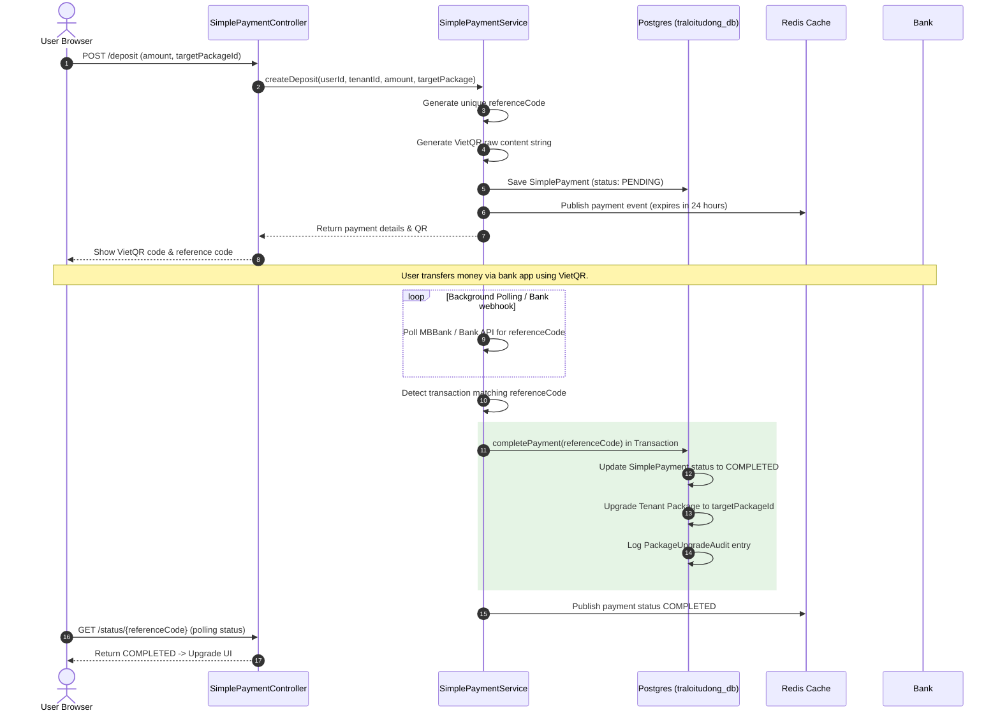

# 💵 SimplePayment Hub API Documentation

## Overview

The **SimplePayment Hub** provides consolidated subscription package management (SaaS Packages) and automated bank deposits via **VietQR** for the chatbot SaaS platform. 

It replaces the legacy, distributed **Billing Hub** and **Wallet Hub**. Instead of complex distributed transactions (Sagas), SimplePayment Hub leverages local database transactions (`@Transactional`) in the shared database `traloitudong_db` to ensure strong consistency and high reliability.

---

## 📦 Package Management API

All endpoints for packages are prefixed with `/api/packages`.

### Get Active Packages
Retrieve all active packages ordered by their sorting priority (public endpoint).
* **URL:** `GET /api/packages/active`
* **Security:** Public (No authorization required)
* **Response:**
```json
{
  "success": true,
  "message": "Active packages retrieved successfully",
  "data": [
    {
      "id": 1,
      "packageId": "free",
      "name": "Free Package",
      "price": 0.00,
      "maxBots": 1,
      "maxUsers": 2,
      "maxMessagesPerMonth": 1000,
      "active": true
    },
    {
      "id": 2,
      "packageId": "pro",
      "name": "Pro Package",
      "price": 200000.00,
      "maxBots": 10,
      "maxUsers": 10,
      "maxMessagesPerMonth": 50000,
      "active": true
    }
  ]
}
```

### Get Package by Package ID
Retrieve details of a specific package by its string ID (e.g. `free`, `pro`).
* **URL:** `GET /api/packages/by-package-id/{packageId}`
* **Security:** Public

### Get All Packages (Admin Only)
Retrieve all packages including inactive ones.
* **URL:** `GET /api/packages`
* **Security:** Requires role `SYSTEM_ADMIN`

### Create New Package (Admin Only)
* **URL:** `POST /api/packages`
* **Security:** Requires role `SYSTEM_ADMIN`
* **Request Body:**
```json
{
  "packageId": "enterprise",
  "name": "Enterprise Package",
  "price": 1000000.00,
  "maxBots": 100,
  "maxUsers": 50,
  "maxMessagesPerMonth": 1000000,
  "active": true,
  "sortOrder": 3
}
```

### Update Package (Admin Only)
* **URL:** `PUT /api/packages/{id}`
* **Security:** Requires role `SYSTEM_ADMIN`

### Delete Package (Admin Only - Soft Delete)
* **URL:** `DELETE /api/packages/{id}`
* **Security:** Requires role `SYSTEM_ADMIN`

### Force Reinitialize Packages (Dev/Staging Only)
Reinitialize the default packages in English/Vietnamese language configurations.
* **URL:** `POST /api/packages/force-reinitialize`

---

## 💳 Payment & Deposit API

All payment and deposit endpoints are prefixed with `/api/simple-payment`.

### Create Deposit Request (VietQR)
Initialize a payment transaction. Generates a unique `referenceCode` and returns the VietQR string/details for scanning.
* **URL:** `POST /api/simple-payment/deposit`
* **Security:** Authenticated User
* **Request Body:**
```json
{
  "amount": 200000.00,
  "targetPackageId": "pro",
  "description": "Nâng cấp gói Pro"
}
```
* **Response:**
```json
{
  "success": true,
  "message": "Deposit request created successfully",
  "data": {
    "id": 15,
    "userId": 12,
    "tenantId": 5,
    "amount": 200000.00,
    "currency": "VND",
    "referenceCode": "DEP1716434400L",
    "status": "PENDING",
    "targetPackageId": "pro",
    "qrContent": "00020101021238580010A00000072701280006970403011497040311394464160208QRPay020520000530370454062000005802VN5912CHATBOT SAAS6005Hanoi62190815DEP1716434400L6304CA72",
    "expiresAt": "2026-05-24T10:24:59"
  }
}
```

### Check Payment Status
Poll the status of a specific payment using its reference code.
* **URL:** `GET /api/simple-payment/status/{referenceCode}`
* **Security:** Authenticated User
* **Response:**
```json
{
  "success": true,
  "message": "Payment status checked",
  "data": {
    "referenceCode": "DEP1716434400L",
    "status": "COMPLETED",
    "completedAt": "2026-05-23T10:26:00"
  }
}
```

### Get Deposit History
Retrieve the current user's payment history.
* **URL:** `GET /api/simple-payment/history`
* **Security:** Authenticated User

### Get Bank Info
Retrieve the manual transfer bank details configured in the system.
* **URL:** `GET /api/simple-payment/bank-info`
* **Security:** Authenticated User
* **Response:**
```json
{
  "success": true,
  "data": {
    "bankName": "MB Bank (Ngân hàng Quân đội)",
    "accountNo": "9704031139446416",
    "accountName": "CONG TY CHATBOT VIETNAM"
  }
}
```

### Simulate Bank Payment (Development/Testing Environment Only)
Helper endpoint to simulate an incoming bank transfer webhook or polling matches for a reference code.
* **URL:** `POST /api/simple-payment/test/simulate-payment`
* **Request Body:**
```json
{
  "referenceCode": "DEP1716434400L",
  "amount": 200000.00,
  "bankTransactionId": "FT26052388910"
}
```

### Manually Complete Payment (Admin Only)
Allow system administrators to force complete a pending payment (e.g., when manual banking confirmation is required).
* **URL:** `POST /api/simple-payment/admin/complete/{referenceCode}`
* **Security:** Requires role `SYSTEM_ADMIN`

---

## 🗄️ Data Models

### 1. Package
Maps to table `packages` in the default database `traloitudong_db`. Represents the subscription plan parameters.
* `id` (Long, PK): Auto-increment identifier.
* `packageId` (String, Unique): ID code of the package (`free`, `pro`, `enterprise`).
* `name` (String): Name of the package.
* `price` (BigDecimal): Price of the package in VND.
* `maxBots` (Integer): Message limit. Maximum number of chatbots allowed to create.
* `maxUsers` (Integer): Maximum number of team members in a workspace.
* `maxMessagesPerMonth` (Long): Monthly messaging limit.
* `active` (Boolean): Status indicator of package availability.

### 2. SimplePayment
Maps to table `simple_payments` in the default database `traloitudong_db`. Tracks VietQR deposit transactions.
* `id` (Long, PK): Auto-increment identifier.
* `userId` (Long): User requesting the deposit.
* `tenantId` (Long): Tenant/Workspace associated with the user.
* `amount` (BigDecimal): Payment amount in VND.
* `referenceCode` (String, Unique): Unique transfer code added to the bank description.
* `status` (Enum): Transaction status (`PENDING`, `COMPLETED`, `FAILED`, `EXPIRED`).
* `targetPackageId` (String): The package the user wants to upgrade to upon completion.
* `qrContent` (String): Generated VietQR raw string content.
* `bankTransactionId` (String): Transaction ID returned from MBBank / VNPay.
* `expiresAt` (LocalDateTime): Expiry time for transaction payment (defaults to 24h).

### 3. PackageUpgradeAudit
Maps to table `package_upgrade_audits` in the default database `traloitudong_db`. Stores log records of plan upgrades.
* `id` (Long, PK): Auto-increment identifier.
* `tenantId` (Long): Workspace identifier.
* `oldPackageId` (String): Previous package ID.
* `newPackageId` (String): Upgraded package ID.
* `upgradedAt` (LocalDateTime): Date of upgrade action.
* `upgradeStatus` (String): Status record.

---

## 🔄 Integration Flow


